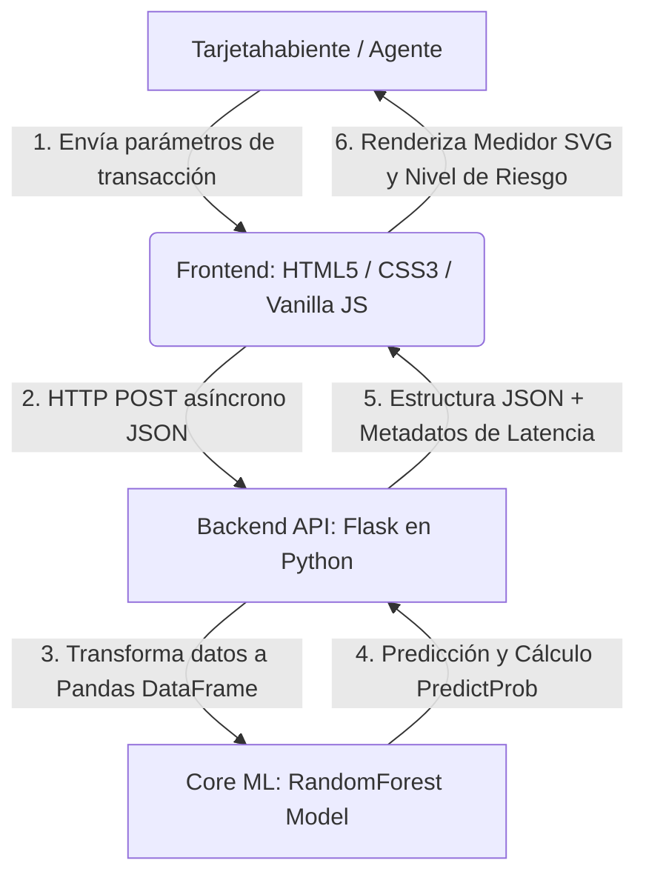

# Resumen Ejecutivo: Sentinel AI - Sistema de Detección de Fraude en Tiempo Real

Este documento técnico detalla el diseño, la implementación, el valor de ingeniería y la arquitectura de integración de **Sentinel AI**, una plataforma full-stack para la detección y mitigación preventiva de transacciones bancarias fraudulentas.

El sistema acopla un motor predictivo basado en Machine Learning supervisado con una API de baja latencia en Flask y un panel de control interactivo (Frontend) moderno de nivel premium.

---

## 👥 Equipo de Desarrollo / Autores

Este proyecto ha sido desarrollado e implementado por el siguiente equipo:

*   **Juan Sebastian Gomez Forero**
*   **Gabriel Felipe Garzon Daza**
*   **Hawi Daniel Acevedo Sanchez**
*   **Andres Santiago Jimenez Guzman**
*   **Edison Santiago Gómez Anzola**

---

## 1. Arquitectura de Integración End-to-End

El sistema se estructura bajo un diseño de microservicios desacoplados que optimiza la latencia del diagnóstico y garantiza la escalabilidad horizontal:

---

## 2. Pipeline de Machine Learning (ML Pipeline)

La robustez de la predicción proviene de un análisis estructurado de las métricas espaciales, temporales y de comportamiento del usuario.

### Ingeniería de Atributos y EDA
El modelo procesa 7 variables clave en tiempo de ejecución:
*   `amount`: Monto total de la transacción actual.
*   `hour`: Franja horaria de ejecución (0-23) para rastrear consumos inusuales en horas de la madrugada.
*   `day_of_week`: Día de la semana (0-6) que mapea los hábitos cíclicos del cliente.
*   `transactions_last_24h`: Frecuencia de uso del medio de pago en un período crítico de 24 horas.
*   `avg_amount_user`: Línea base de consumo promedio histórico del usuario.
*   `distance_from_home`: Distancia geográfica medida en kilómetros desde el hogar registrado del tarjetahabiente.
*   `is_international`: Variable binaria que indica si el procesamiento es transfronterizo.

### El Desafío del Desbalance Extremo de Clases
En la detección de fraude, las transacciones legítimas superan a las fraudulentas en proporciones típicas de 99.9% a 0.1%. Si un algoritmo se entrena directamente con este set de datos, desarrollará un **sesgo de clase mayoritaria**, aprobando automáticamente todas las transacciones para lograr un 99.9% de precisión vacía (pero con 100% de falsos negativos de fraude).

> [!IMPORTANT]
> **Mitigación mediante `class_weight='balanced'`**  
> Durante la fase de entrenamiento en Google Colab, se implementó el hiperparámetro `class_weight='balanced'` en el clasificador `RandomForestClassifier`. Esta técnica ajusta automáticamente los pesos de las clases de manera inversamente proporcional a las frecuencias en los datos de entrenamiento:
> 
> $$W_j = \frac{N}{C \times N_j}$$
> 
> Donde $N$ es el número total de muestras, $C$ es la cantidad de clases y $N_j$ es el número de muestras en la clase $j$. Esto penaliza fuertemente los errores cometidos en la clase minoritaria (fraude), obligando a los árboles de decisión a encontrar patrones distintivos a pesar de la escasez de datos.

### Algoritmo: Random Forest Classifier
Se seleccionó un ensamble de **Bosques Aleatorios** (Random Forest) serializado en `model.pkl`. Este algoritmo destaca por:
1.  **Reducción del Sobreajuste (Overfitting):** Al construir múltiples árboles de decisión sobre subconjuntos bootstrap y promediar sus predicciones, reduce significativamente la varianza.
2.  **No Linealidad:** Captura interacciones complejas de forma nativa (por ejemplo: un monto alto *no* es fraude por sí mismo, pero combinado con una distancia extrema de 5,000 km y en una hora de madrugada 3 AM, incrementa la probabilidad exponencialmente).
3.  **Predict Proba:** Genera calibraciones probabilísticas de riesgo individuales útiles para la toma de decisiones flexibles en el negocio, más allá de una clasificación estricta de 0 o 1.

---

## 3. Arquitectura del Backend: Servidor API Flask

El backend en `app.py` actúa como una pasarela intermedia (API Gateway) de baja latencia que consume el modelo serializado en formato binario (`pickle`).

### Decisiones Clave de Diseño en el Servidor:
*   **Encapsulamiento del Modelo:** Carga el archivo `model.pkl` en memoria **una sola vez** al arrancar la aplicación (`app.run`), reduciendo drásticamente la latencia en las subsecuentes solicitudes de predicción.
*   **Servido Unificado:** Utiliza la capacidad de servidor estático de Flask para mapear la ruta raíz `/` al archivo frontend `index.html`. De esta forma, el sistema completo funciona desde un único puerto de red.
*   **Habilitación de CORS:** Mediante `Flask-CORS`, permite que el frontend asíncrono se comunique con la API incluso si se despliega en subdominios o servidores estáticos separados.
*   **Validación de Esquema y Robustez:** Implementa un control riguroso de excepciones. Si falta un parámetro, el servidor responde con un código HTTP `400 Bad Request` listando los campos requeridos, evitando caídas inesperadas.
*   **Cálculo de Latencia en Tiempo Real:** Calcula el delta de tiempo de procesamiento de CPU y lo devuelve como metadato, ideal para auditorías de velocidad y SLAs del servicio.

---

## 4. Diseño del Frontend: Dashboard Interactivo Premium e Interpretabilidad (XAI)

La interfaz se ha transformado de una página web básica a un panel Fintech de vanguardia estética y experiencia de usuario optimizada:

### Aspectos de Experiencia y Diseño Visual:
*   **Estética Glassmorphism Premium:** Desarrollado bajo un esquema oscuro ultra moderno con degradados HSL translúcidos y desenfoques de fondo (`backdrop-filter`).
*   **Quick Presets (Casos de Uso Predefinidos):** Permite a los evaluadores cargar instantáneamente 3 escenarios de negocio reales:
    1.  *Compra Habitual:* Transacción segura común en supermercado local.
    2.  *Anomalía Nocturna:* Retiro sospechoso con desviación moderada.
    3.  *Fraude Internacional:* Movimiento transfronterizo a las 2 AM con un monto anormal de alto riesgo.
*   **Medidor de Riesgo Vectorial (SVG Gauge):** Reemplaza las alertas planas por un dial dinámico y animado que ajusta el perímetro de su trazo y su color en base a la probabilidad predictiva de fraude en tiempo real.
*   **Explicabilidad Dinámica (Explainable AI - XAI):** El sistema cuenta con una capa heurística visual que interpreta en tiempo de ejecución las métricas cargadas manualmente y detalla al usuario de manera comprensible el **"por qué"** de su veredicto (desviaciones de gasto respecto a su promedio histórico, distancias geográficas atípicas del hogar, o transacciones en franjas horarias nocturnas críticas).
*   **Recomendaciones Contextuales Dinámicas:** El sistema no solo muestra un número, sino que interpreta la probabilidad para emitir una orden accionable basada en el nivel de riesgo:
    *   `Riesgo Bajo (<15%)`: *Transacción Autorizada.* Plena coincidencia con hábitos seguros del cliente.
    *   `Riesgo Medio (15%-50%)`: *Transacción Aprobada con Seguimiento.* Se registra una ligera anomalía.
    *   `Riesgo Alto (50%-85%)`: *Transacción Retenida.* Requiere validación de identidad o doble factor de autenticación.
    *   `Riesgo Crítico (>85%)`: *Alerta de Fraude: Bloqueo de Cuenta.* Comportamiento altamente inusual y peligroso.

---

## 5. Siguientes Pasos para Despliegue en Producción (MLOps)

Para escalar este sistema de una etapa local/demostrativa a un entorno corporativo elástico, se sugieren las siguientes optimizaciones:

1.  **Contenerización con Docker:** Crear una imagen Docker multiplataforma para desplegar el servidor Flask en AWS ECS, Kubernetes o GCP Cloud Run de forma reproducible.
2.  **Servidor de Producción (WSGI):** Reemplazar el servidor de desarrollo por defecto de Flask por un servidor robusto como **Gunicorn** o **uWSGI** con múltiples hilos paralelos de procesamiento (`workers`).
3.  **Monitoreo de Deriva del Modelo (Model Drift):** Configurar dashboards en herramientas como MLflow o Evidently AI para evaluar si las características del fraude financiero han cambiado en el tiempo y cuándo es necesario volver a entrenar el clasificador Random Forest.
4.  **Caché en Redis:** Guardar en una base de datos en memoria intermedia (Redis) los valores calculados de `avg_amount_user` e historiales de los usuarios para evitar sobrecargar la base de datos transaccional en cada análisis.
